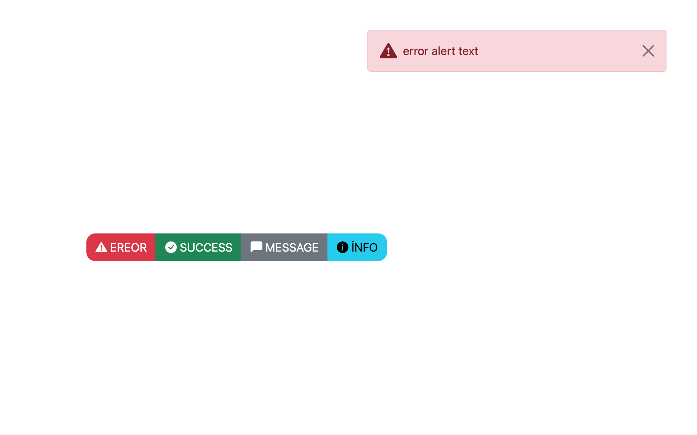

## connet-flash module example

## before you start

<code>npm i </code>

Make sure you have installed nodemon before getting any errors.

<code>npm start </code>

Use the code below after adding jquery to your page for automatic closing of alerts:

<code>
$(document).ready (function(){
    window.setTimeout(function () { 
        $(".alert").alert('close'); 
     }, 2000);    
 });
</code>